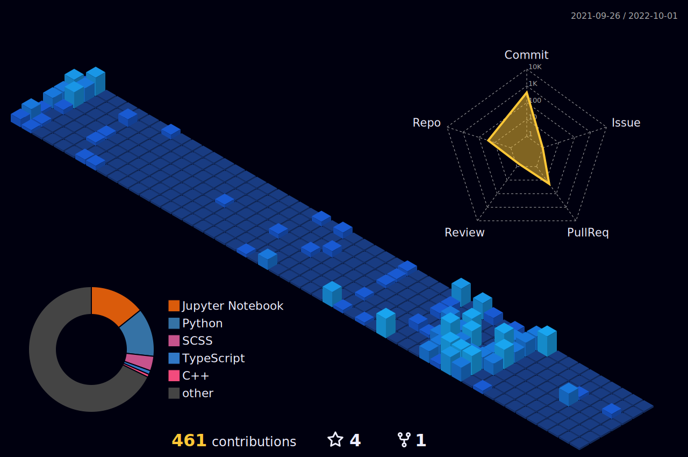

<h1 align ="left">Hey there! I'm Anant&nbsp;&nbsp;</h1>

<h2> About Me ☕</h2>

A **reasearch enthusiast** whose day starts on screen and ends gazing stars in night sky. I love **Stargazing** 🌌 and playing ♟️.

My research field is **Computer Vision and Image processing**.

<h2 align  = "left">You can reach me here... 📮 </h2>

<h2>Language and tools :books: </h2>

<h2> Github Stats :book:</h2>

<!-- -->

<h2> Contributions 🕰️</h2>

  

<!--

-->

<!--  Credits -->
<!--  Icons : Flaticon -->
