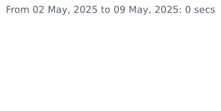
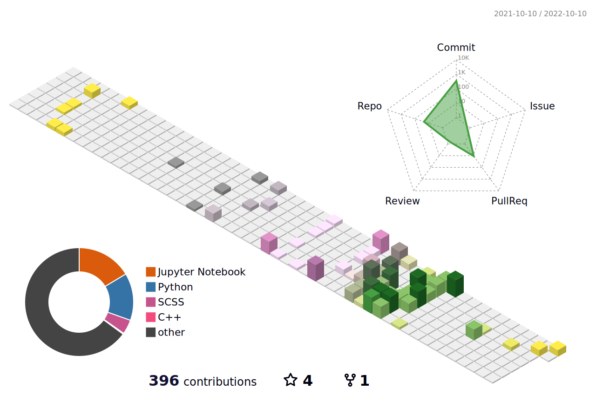

  &ensp; 
  
  

<h1> Let's start with a ... 
</h1>

  <picture>
    <source media="(prefers-color-scheme: dark)" srcset="https://64.media.tumblr.com/d14995c11b9f3b9c94347e3b5d790d24/babbd570ca3d6c19-f3/s500x750/5fd44a8447f25e68a4da3740b06c65adc597bcea.gif" align="right" width="40%">
    
  </picture>
  <u>
    <li>
       &nbsp; I'm pursuing my bachelor's in Computer Science.
    <li>
       &nbsp; Focused on Data science and Machine learning.
    </li>
    <li>
       &nbsp; I've done research internships in field of CV/ML.
    </li>
    <li>
      &nbsp; Learning <b>Deep reinforcement learning.</b>
    </li>
    <li>
      &nbsp; I love Stargazing and <b>
        <a href="https://github.com/Anant-mishra1729/Village-Linux-rice">Ricing my linux desktop.</a>
      </b>
    </li>
    <li>
      &ensp; Visit my forest <a href="https://tree-nation.com/profile/anant-mishra">
        <b>here!</b>
      </a>
    </li>
    <li>
      &nbsp; For more insights please checkout my <b>
        <a href="https://anant-mishra1729.github.io/portfolio-site/">Portfolio</a>
      </b>
    </li>
  </u>

<h2>I've worked with...</h2>

<h3>Spent this week on...</h3>

<h2 align="left">Profile summary</h2>

  <picture>
    <source srcset="https://github-readme-stats.vercel.app/api?username=Anant-mishra1729&show_icons=true&theme=blueberry&hide_border=true&bg_color=1a1d26" media="(prefers-color-scheme: dark)" width="47%" />
    
  </picture>
  <picture>
    <source media="(prefers-color-scheme: dark)" srcset="https://github-readme-streak-stats.herokuapp.com?user=Anant-mishra1729&theme=blueberry&hide_border=true&background=1a1d26" width="50%">
    
  </picture>

  

    <h3>Contribution history&ensp;</h3>
    
  

  

    
    <picture>
      <source media="(prefers-color-scheme: dark)" srcset="profile-3d-contrib/profile-night-view.svg" width="98%">
      
    </picture>
  

   

<h2 align="left">Behold, a glimpse into the universe from my diary... 
</h2> 

>"The starlight we see each night is a window to the past, a glimpse of the forgotten universe...  It holds within the secrets of creation, a tale etched into the fabric of cosmos   frozen in time, waiting to be uncovered..." 

  
  <b>Thanks for visiting! hope to see you again... 

      </h3>
    

      
      
    

