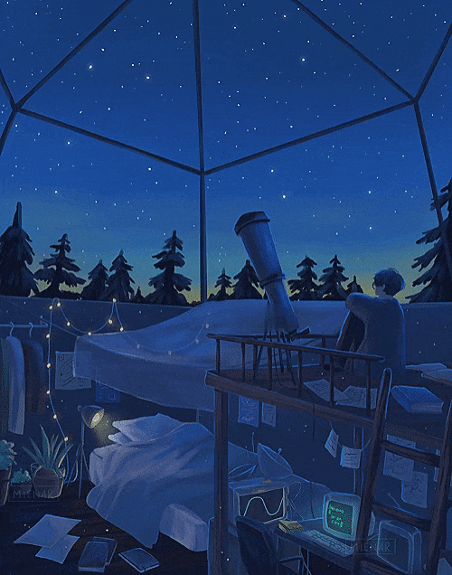
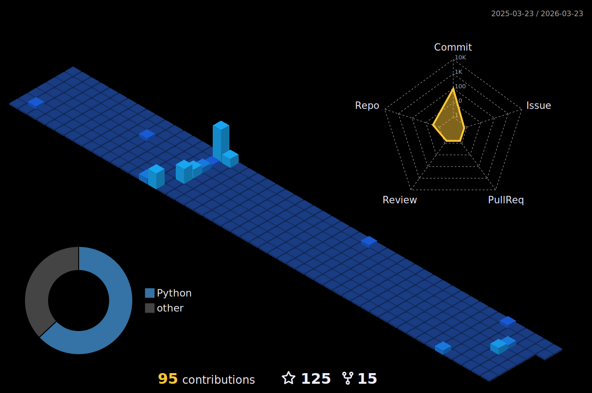

<!-- Header 

 -->

<!-- Header icons -->

 <!-- Day and Night icons -->
  

  

 

<!-- Introduction + Coffee -->
<h1> Hello, I am Anant </h1>

 <picture>
    <source media="(prefers-color-scheme: light)" srcset="https://images.squarespace-cdn.com/content/v1/5c4ece0e3917ee277d32eaf3/1570273077298-30G7YE5PFHJW058FFNNJ/summer-ani.gif" align="right" width="30%">
    
  </picture>

<!--   About me -->
Regularly working on open-source tools and learning along the way, while currently working as a Database Administrator - always open to contribute wherever I can.

Currently working on side-project `Wakadash` (Wakatime API Client & Dashboard)

<!-- Programming languages -->

**I've worked with**

<h3> Blogs & posts... </h3>

		  
<!-- BLOG-POST-LIST:START -->
- [Hashing Pairs Like a Pro in C++](https://dev.to/anantmishra1729/placeholder-contributor-3gb6)
- [Introducing Operator-Caska: The Perfect Blend of CaskaydiaCove and Operator Mono](https://dev.to/anantmishra1729/introducing-operator-caska-the-perfect-blend-of-caskaydiacove-and-operator-mono-4o0b)
- [Running Jupyter Notebook in Background Mode on a Remote Server](https://medium.com/@amishra1577/running-jupyter-notebook-in-background-mode-on-a-remote-server-64f1872cef6a?source=rss-b63f40c330a8------2)
- [Simplify Password Management with the &#39;pass&#39; Command-Line Password Manager](https://dev.to/anantmishra1729/simplify-password-management-with-the-pass-command-line-password-manager-2pbg)
- [How to Add WhatsApp to Your Linux Desktop: A Step-by-Step Guide](https://medium.com/@amishra1577/how-to-add-whatsapp-to-your-linux-desktop-a-step-by-step-guide-21276cbf23a9?source=rss-b63f40c330a8------2)
<!-- BLOG-POST-LIST:END -->

<!-- Wakatime -->
<h2>Weekly dev breakdown...</h2>

<picture>
<source srcset="https://github-readme-stats.vercel.app/api/top-langs/?username=Anant-mishra1729&langs_count=10&hide_border=true&layout=compact&hide=jupyter%20notebook,html,css" media="(prefers-color-scheme: light)" width="36%" />

</picture>

<!-- Profile summary -->
<h2>Profile summary </h2>

 <picture align = "left">
    <source srcset="https://github-readme-stats.vercel.app/api?username=Anant-mishra1729&show_icons=true&hide_border=true" media="(prefers-color-scheme: light)" width="49%" />
    
  </picture>
<picture align = "left">
    <source srcset="https://streak-stats.demolab.com/?user=Anant-mishra1729&hide_border=true" media="(prefers-color-scheme: light)" width="47%" />
    
</picture>
  <picture align = "right">
    <source media="(prefers-color-scheme: light)" srcset="images/profile-custom-season.svg" width = "98%">
    
  </picture>

## Working on...

<!--<a href = "https://github.com/Anant-mishra1729/Neural-network-from-Scratch">
<picture>
  <source
    srcset="https://github-readme-stats-git-master-anant-mishra1729.vercel.app/api/pin/?username=Anant-mishra1729&repo=Neural-network-from-Scratch&theme=github_dark"
    media="(prefers-color-scheme: dark)"
  />
  
</picture>
</a>

<a href = "https://github.com/Anant-mishra1729/Machine-Learning-Notebooks">
<picture>
  <source
    srcset="https://github-readme-stats-git-master-anant-mishra1729.vercel.app/api/pin/?username=Anant-mishra1729&repo=Machine-Learning-Notebooks&theme=github_dark"
    media="(prefers-color-scheme: dark)"
  />
  
</picture>
</a> -->
<a href = "https://github.com/Anant-mishra1729/Neural-network-from-Scratch">
<picture>
  <source
    srcset="https://github-readme-stats.vercel.app/api/pin/?username=Anant-mishra1729&repo=Neural-network-from-Scratch&theme=github_dark"
    media="(prefers-color-scheme: dark)"
  />
  
</picture>
</a>
<a href = "https://github.com/Anant-mishra1729/Machine-Learning-Notebooks">
<picture>
  <source
    srcset="https://github-readme-stats.vercel.app/api/pin/?username=Anant-mishra1729&repo=Machine-Learning-Notebooks&theme=github_dark"
    media="(prefers-color-scheme: dark)"
  />
  
</picture>

<!--

<h2>Holopin badges </h2>

-->

<!-- Diary -->
<!--<h4 align="left">From my diary, a glimpse into the universe ... </h4>

> "The starlight we see each night is a window to the past, a glimpse of the forgotten universe...  It holds within the secrets of creation, a tale etched into the very fabric of cosmos  frozen in time, waiting to be uncovered..."
-->

<!--  -->

<!-- <b>I've pinned a few projects below, hope you like them... </b> -->

  <!-- Footer

  
  

-->
