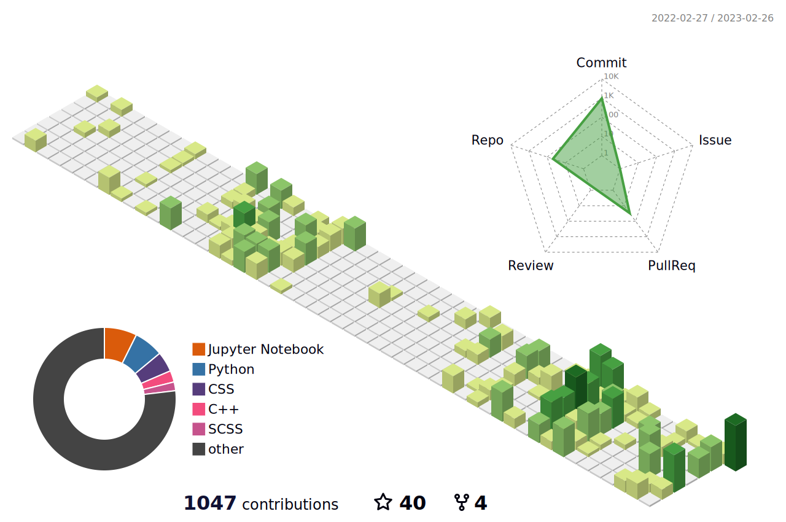

<!--  -->
<h2 align ="left">Welcome to my profile, I'm <a target = "_blank" href = "https://anant-mishra1729.github.io/portfolio-site/">Anant</a>&nbsp;&nbsp;</h2>

* :telescope: Currently working on **Finger Spell**, an ISL interpreter.
* :seedling: Learning API integration.
* 🤝 Looking to collaborate on any pro-bono data science project.
* 👽 **Fun fact ~ Swith your github theme and watch this readme change its colors!**
* 🌌 Talking about hobbies, I love **Stargazing** and playing ♟️
 

<h2>Tech-stack </h2>

<!-- <picture> -->
<!--   <source media="(prefers-color-scheme: dark)" srcset="https://skillicons.dev/icons?i=tensorflow,cpp,python,flutter,flask,django,nodejs,react,js,html,css,mysql,mongodb&theme=dark"> -->
  
<!-- </picture> -->

<h2> Github Stats </h2>

<picture>
<source 
  srcset="https://github-readme-stats.vercel.app/api?username=Anant-mishra1729&show_icons=true&theme=tokyonight&hide_border=true"
  media="(prefers-color-scheme: dark)" width = "49%"
/>
<source
  srcset="https://github-readme-stats.vercel.app/api?username=Anant-mishra1729&show_icons=true"
  media="(prefers-color-scheme: light), (prefers-color-scheme: no-preference)" width = "49%"
/>

</picture>
<picture>
  <source media="(prefers-color-scheme: dark)" srcset="https://github-readme-streak-stats.herokuapp.com?user=Anant-mishra1729&theme=tokyonight&hide_border=true" width = "49%">
  
</picture>

<!-- 

 -->

<h2>&nbsp; A year in review... ⏱️</h2>

  
<picture>
  <source media="(prefers-color-scheme: dark)" srcset="profile-3d-contrib/profile-night-view.svg">
  
</picture>

#### ❤️ An excerpt from my diary
  <i>&nbsp;Everynight in the light of stars, we see our forgotten past...</i> 

<!-- Further Modifications -->

<!-- 

 -->
 
  <!-- -->

<!-- <h4 align  = "left">To have some more insights, check out my portfolio ...</h4>
 -->

<!--

-->

<!--  Credits -->
<!--  Icons : Flaticon -->
