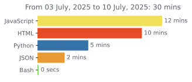
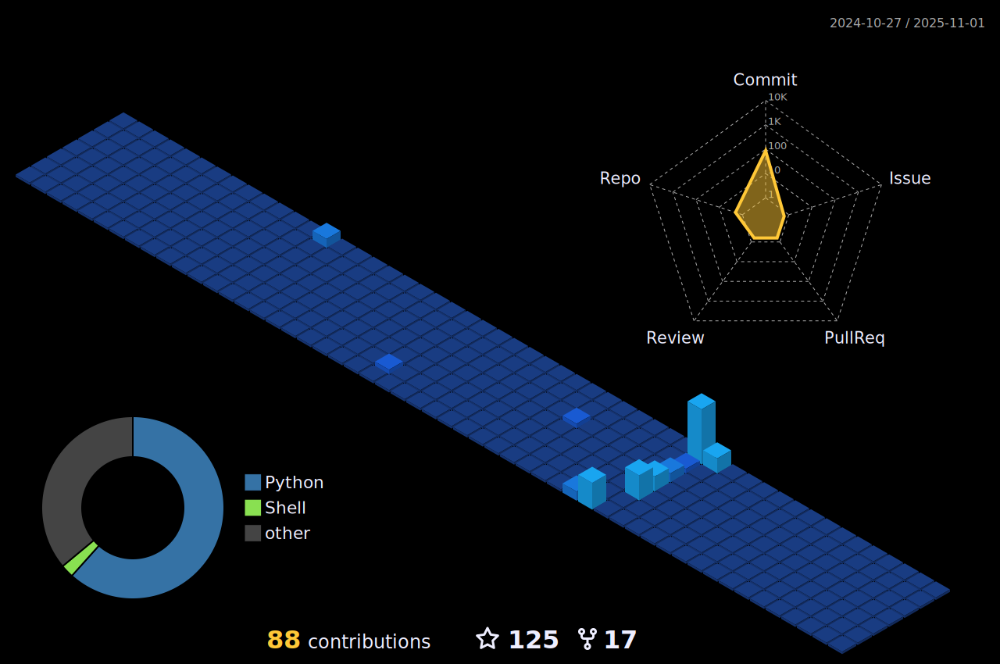

<!-- Header -->

<!-- Header icons -->

  &ensp;  &ensp;
  

<!-- Day and Night icons -->
  

<!-- Introduction + Coffee -->
<h1> Let's start with an intro...</h1>

<!-- Introduction image -->
  <picture>
    <source media="(prefers-color-scheme: light)" srcset="https://camo.githubusercontent.com/5ddf73ad3a205111cf8c686f687fc216c2946a75005718c8da5b837ad9de78c9/68747470733a2f2f7468756d62732e6766796361742e636f6d2f4576696c4e657874446576696c666973682d736d616c6c2e676966" align="right" width="42%">
    
  </picture>
  <!--  -->

<!--   About me -->
  <ul>
    <li>
       &nbsp; I'm pursuing my bachelor's in Computer Science.
    <li>
       &nbsp; Focused on Data science.
    </li>
    <li>
       &nbsp; I've done research in ML and CV.
    </li>
    <li>
      &nbsp; Learning <b>Deep reinforcement learning.</b>
    </li>
    <li>
      &nbsp; I love Stargazing and <b>
      <a href="https://github.com/Anant-mishra1729/Village-Linux-rice">Ricing my linux.</a>
      </b>
    </li>
    <li>
      &ensp; Visit my forest <a href="https://tree-nation.com/profile/anant-mishra">
      <b>here!</b>
      </a>
    </li>
	</ul>

<!-- Programming languages -->
<h2>I've worked with...</h2>

<h3> &nbsp; Blog posts </h3>

		  
<!-- BLOG-POST-LIST:START -->
<!-- BLOG-POST-LIST:END -->
		  

  

<!-- Wakatime -->
<h2>Weekly dev breakdown...</h2>

<!-- Profile summary -->
<h2 align="left">Profile summary</h2>

  <picture>
    <source srcset="https://github-readme-stats.vercel.app/api?username=Anant-mishra1729&show_icons=true" media="(prefers-color-scheme: light)" width="47%" />
    
  </picture>
  <picture>
    <source media="(prefers-color-scheme: light)" srcset= "https://github-readme-streak-stats.herokuapp.com?user=Anant-mishra1729&theme=default" width="50%">
    
  </picture>
    
  <picture>
    <source media="(prefers-color-scheme: light)" srcset="images/profile-custom-season.svg" width = "95%">
    
  </picture>

<!-- Diary -->

<h2 align="left">Behold, a glimpse into the universe from my diary... &ensp;</h2>

>"The starlight we see each night is a window to the past  a glimpse of the forgotten universe...  It holds within the secrets of creation, a tale etched into the very fabric of cosmos   frozen in time, waiting to be uncovered..." 

  <!-- Footer -->

  
  

